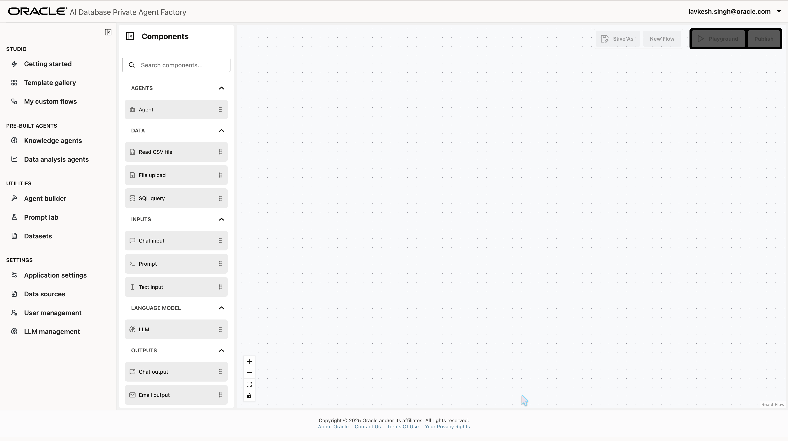
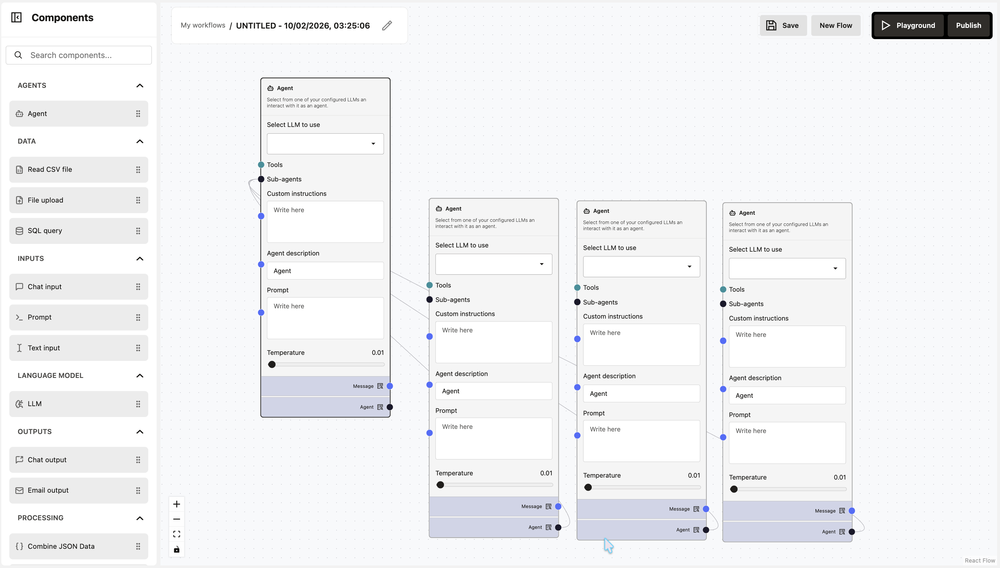
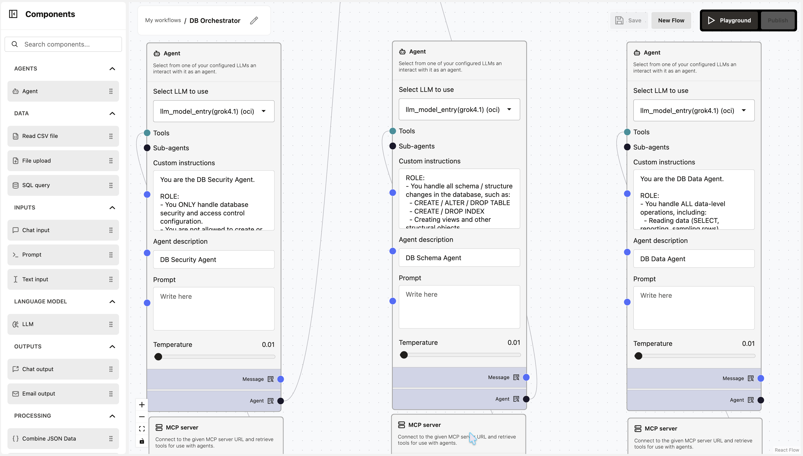

# How do I create a Database Actions Orchestrator?
**Estimated Time: 15 minutes**

## Introduction

This sprint guides you through creating an **Oracle DB Master Orchestrator** using the Oracle Agent Factory. This powerful agent orchestrates three specialist agents: Security, Schema, and Data, ensuring secure and structural integrity while allowing natural language database interaction.

**(Architecture Overview)**

## Prerequisites
Before starting, ensure you have:
1.  **Set up the MCP Server**: The backend logic relies on a custom MCP server. If you haven't set this up, please follow the [MCP Server Setup LiveLab](#). (_Placeholder Link_)
    *   The backend logic (similar to `mcpserver.py` and `wayflowmcp.py`) must be running on your designated OCI VM.
2.  **Access to Oracle Agent Factory**: You must be logged into the Agent Factory console.

## Step 1: Open Agent Factory Home Screen
Open the **Agent Factory Home Screen**. This is your command center for building and managing intelligent agents.

## Step 2: Open Custom Flows and Create Flow
Navigate to the **"My custom flows"** section. You will see a list of existing flows. Click the **Create flow** button to start a new project.

## Step 3: Blank Canvas
You will be presented with a **blank canvas**. This is where you can visually build your agent flow.

## Step 4: Add Main Agent and Sub-Agents
1.  **Pull up the Agent Node**: Drag an **Agent** node onto the blank screen.
    
2.  **Add Sub-Agents**: Add the sub-agents (Security, Schema, Data) and connect them to the main node.
    

## Step 5: Add MCP Tools and Chat Interface
1.  **Add MCP Server Nodes**: Add an **"MCP server"** node to **each** agent (Main and Sub-agents) to enable tool access.
    
2.  **Connect Chat Interface**:
    *   Add a **Chat Input** node and connect it to the Main Agent's input.
    *   Add a **Chat Output** node and connect it to the Main Agent's output.
    

## Step 6: Add Custom Instructions
Configure each agent with its specific role and custom instructions.

1.  **Main Agent**: Set the custom instructions to describe the orchestrator role.
    
2.  **Sub-Agents**: Configure the DB Security Agent, DB Schema Agent, and DB Data Agent with their respective roles.
    
3.  **Save** your flow.

## Step 7: Test in Playground
1.  Click the **Playground** button in the top right corner.
2.  Interact with your agent using natural language commands like:
    *   "Create user bob"
    *   "Show me all tables in the database"
    *   "Grant SELECT on employees to bob"
    

## Conclusion
You have successfully created a **Database Actions Orchestrator** that routes user requests to specialized agents for Security, Schema, and Data operations. This multi-agent architecture ensures clean separation of concerns and follows the principle of least privilege.

## Acknowledgements
*   **Author** - Lavkesh Singh
*   **Last Updated By/Date** - February 2026
