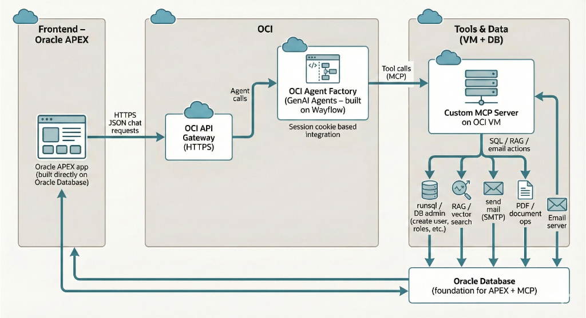
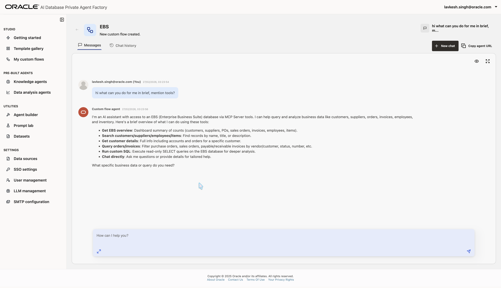

# How do I create an Oracle EBS Agent?
**Estimated Time: 15 minutes**

## Introduction

This sprint guides you through creating an **Oracle EBS Agent** using the Oracle Agent Factory. This powerful agent interacts directly with an Oracle E-Business Suite (EBS) database through a secure SSH bridge and an MCP Server, providing you with 11 read-only tools to retrieve and analyze critical business data (HR, AP/AR, Inventory, Order Management).

**(Architecture Overview)**

## Prerequisites
Before starting, ensure you have:
1.  **Set up the MCP Server**: The backend logic relies on a custom MCP server bridge. If you haven't set this up, please follow the [MCP Server Setup LiveLab](#). (_Placeholder Link_)
    *   The backend logic must be running on your designated OCI VM, bound to port **8012**.
2.  **Access to Oracle Agent Factory**: You must be logged into the Agent Factory console.

## Step 1: Open Agent Factory Home Screen
Open the **Agent Factory Home Screen**. This is your command center for building and managing intelligent agents.

## Step 2: Open Custom Flows and Create Flow
Navigate to the **"My custom flows"** section. You will see a list of existing flows. Click the **Create flow** button to start a new project.

## Step 3: Blank Canvas
You will be presented with a **blank canvas**. This is where you can visually build your agent flow.

## Step 4: Add Main Agent and Chat Interface
1.  **Pull up the Agent Node**: Drag an **Agent** node onto the blank screen.
2.  **Connect Chat Interface**:
    *   Add a **Chat Input** node and connect it to the Agent's input.
    *   Add a **Chat Output** node and connect it to the Agent's output.

## Step 5: Add MCP Server Node
To connect your agent to your EBS instance:
1.  Drag an **"MCP server"** node onto the canvas and connect it to the Agent node's 'Tools' port.
2.  **Configure URL**: Select the node and in the configuration panel, enter your server URL:
    *   `http://<your-mcp-server-ip>:8012/mcp`
    *   Set **Auth type** to `None` (or configure as per your security setup).
    *   This will automatically fetch the 11 specialized EBS SQL tools.

## Step 6: Add Custom Instructions
Configure the agent with its specific role and custom instructions.

1.  **Agent Role**: In the Agent node's configuration, set the instructions:
    *   "You are an AI assistant with access to an Oracle E-Business Suite (EBS) database via MCP Server tools. Help me query and analyze business data like customers, suppliers, orders, invoices, employees, and inventory."
2.  **Save** your flow.
    

## Step 7: Test in Playground
1.  Click the **Playground** button in the top right corner.
2.  Interact with your agent using natural language commands to explore the Vision Demo data. Try prompting:
    *   "Find my biggest customers by order volume."
    *   "Check the 10 latest invoices paid in Accounts Payable."
    *   "Who has the 'System Administrator' responsibility?"
    *   "List expensive items in the inventory for Organization 204."
    *   "Find the top Managers in the organization."
    

## Conclusion
You have successfully created an **Oracle EBS Agent** that bypasses complex driver and environment issues using an SSH-based MCP bridge. You can now securely interact with complex ERP schemas using natural language to answer critical business questions!

## Acknowledgements
*   **Author** - Lavkesh Singh
*   **Last Updated By/Date** - February 2026
