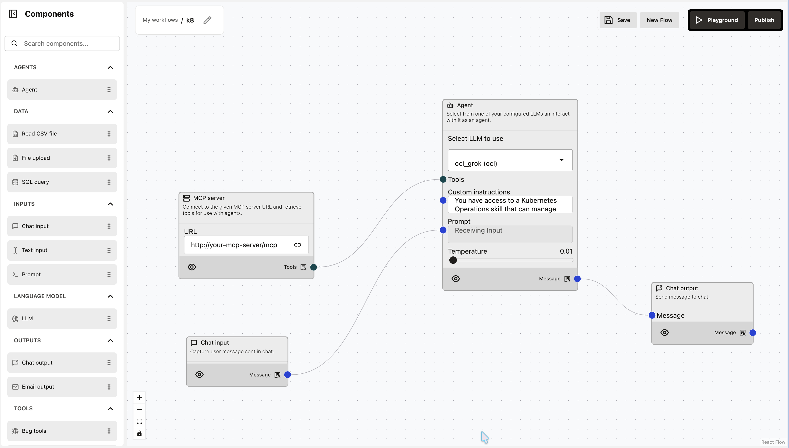
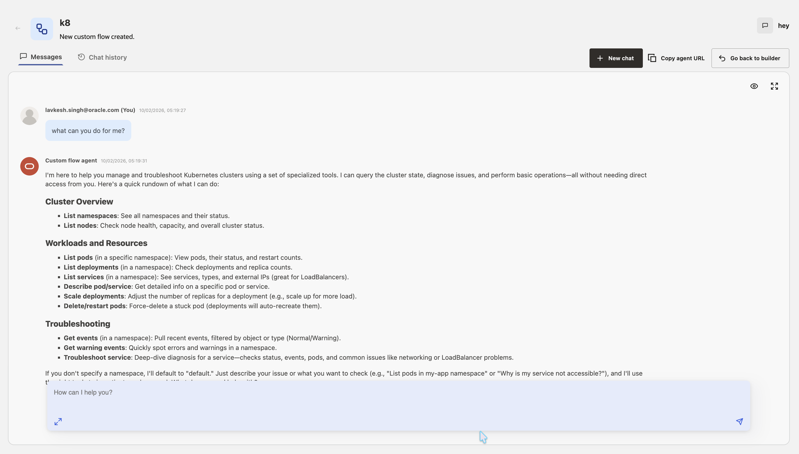

# How do I create a Kubernetes Control Agent?
**Estimated Time: 15 minutes**

## Introduction

This sprint guides you through creating a **Kubernetes Control Agent** using the Oracle Agent Factory. This agent allows you to inspect and control your Kubernetes clusters using natural language commands.

**(Architecture Overview)**

## Prerequisites
Before starting, ensure you have:
1.  **Set up the MCP Server**: The backend logic relies on a custom MCP server. If you haven't set this up, please follow the [MCP Server Setup LiveLab](#). (_Placeholder Link_)
    *   The backend logic (similar to `mcpserver.py` and `wayflowmcp.py`) must be running on your designated OCI VM.
2.  **Access to Oracle Agent Factory**: You must be logged into the Agent Factory console.

## Step 1: Open Oracle Agent Factory
Start from the **Agent Factory Home Screen**. This is your command center for building and managing intelligent agents.

## Step 2: Open Custom Flows and Create Flow
Navigate to the **"My custom flows"** section. You will see a list of existing flows. Click the **Create flow** button to start a new project.

## Step 3: Blank Canvas
You will be presented with a **blank canvas**. This is where you can visually build your agent flow.

## Step 4: Design the Agent Flow
The image below illustrates the flow. This agent connects to a Kubernetes Operations skill via the MCP server.

### Logic Configuration
1.  **Chat Input**: Start with a **"Chat input"** node.
2.  **MCP Server**: Add an **"MCP server"** node.
    *   **URL**: Set this to your MCP endpoint (e.g., `http://<your-mcp-server-ip>:8009/mcp`).
    *   **Auth**: Set to `None`.
3.  **Agent Node**: Add an **"Agent"** node.
    *   **Tools**: Connect the MCP Server to the Agent's **"Tools"** input.
    *   **Custom Instructions**:
        > "You have access to a Kubernetes Operations skill that can manage OKE clusters. Use the provided tools to list pods, check logs, and inspect deployments."
    *   **Model**: Select an OCI-hosted model (e.g., `oci_grok`).
4.  **Chat Output**: Connect the Agent's output to a **"Chat output"** node.

## Step 5: Testing
1.  Click **Playground**.
2.  Try commands like:
    *   "List all pods in the default namespace."
    *   "Get logs for the 'frontend' pod."
    *   "Show me the status of my deployments."
    

## Conclusion
You have created a **Kubernetes Control Agent** that simplifies complex K8s operations into natural language commands.

## Acknowledgements
*   **Author** - Lavkesh Singh
*   **Last Updated By/Date** - February 2026
